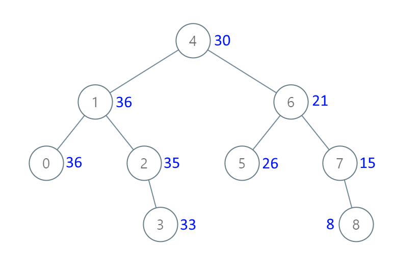
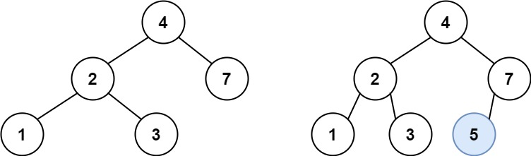
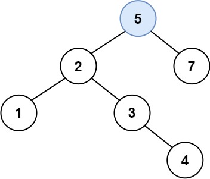
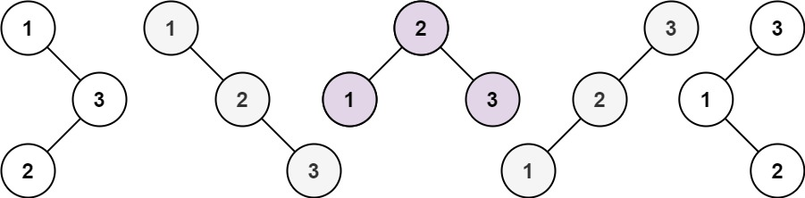

go-algo
===
---
go

## 二叉树

### 105. 从前序与中序遍历序列构造二叉树

根据一棵树的前序遍历与中序遍历构造二叉树。

注意:
你可以假设树中没有重复的元素。

例如，给出

    前序遍历 preorder = [3,9,20,15,7]
    中序遍历 inorder = [9,3,15,20,7]

返回如下的二叉树：

```
     3
    / \
   9   20
  / \
15   7
```

---

### 106. 从中序与后序遍历序列构造二叉树

根据一棵树的中序遍历与后序遍历构造二叉树。

注意:
你可以假设树中没有重复的元素。

例如，给出

    中序遍历 inorder = [9,3,15,20,7]
    后序遍历 postorder = [9,15,7,20,3]

返回如下的二叉树：

```
      3
     / \
    9  20
      /  \
     15   7
```

---

### 538. 把二叉搜索树转换为累加树

给出二叉 搜索 树的根节点，该树的节点值各不相同，请你将其转换为累加树（Greater Sum Tree），使每个节点 node 的新值等于原树中大于或等于 node.val 的值之和。

提醒一下，二叉搜索树满足下列约束条件：

节点的左子树仅包含键 小于 节点键的节点。 节点的右子树仅包含键 大于 节点键的节点。 左右子树也必须是二叉搜索树。 注意：本题和
1038: https://leetcode-cn.com/problems/binary-search-tree-to-greater-sum-tree/ 相同

示例 1：



    输入：[4,1,6,0,2,5,7,null,null,null,3,null,null,null,8]
    输出：[30,36,21,36,35,26,15,null,null,null,33,null,null,null,8]

示例 2：

    输入：root = [0,null,1]
    输出：[1,null,1]

示例 3：

    输入：root = [1,0,2]
    输出：[3,3,2]

示例 4：

    输入：root = [3,2,4,1]
    输出：[7,9,4,10]

提示：

    树中的节点数介于 0 和 104 之间。
    每个节点的值介于 -104 和 104 之间。
    树中的所有值 互不相同 。
    给定的树为二叉搜索树。

---

### 450. 删除二叉搜索树中的节点

给定一个二叉搜索树的根节点 root 和一个值 key，删除二叉搜索树中的 key 对应的节点，并保证二叉搜索树的性质不变。返回二叉搜索树（有可能被更新）的根节点的引用。

一般来说，删除节点可分为两个步骤：

    1.首先找到需要删除的节点；
    2.如果找到了，删除它。

说明： 要求算法时间复杂度为 O(h)，h 为树的高度。

示例:

    root = [5,3,6,2,4,null,7]
    key = 3
    
            5
           / \
          3   6
         / \   \
        2   4   7

    给定需要删除的节点值是 3，所以我们首先找到 3 这个节点，然后删除它。
    
    一个正确的答案是 [5,4,6,2,null,null,7], 如下图所示。
    
            5
           / \
          4   6
         /     \
        2       7
    
    另一个正确答案是 [5,2,6,null,4,null,7]。
    
           5
          / \
         2   6
          \   \
           4   7

---

### 701. 二叉搜索树中的插入操作

给定二叉搜索树（BST）的根节点和要插入树中的值，将值插入二叉搜索树。 返回插入后二叉搜索树的根节点。 输入数据 保证 ，新值和原始二叉搜索树中的任意节点值都不同。 注意，可能存在多种有效的插入方式，只要树在插入后仍保持为二叉搜索树即可。
你可以返回 任意有效的结果 。

示例 1：


        输入：root = [4,2,7,1,3], val = 5
        输出：[4,2,7,1,3,5]
        解释：另一个满足题目要求可以通过的树是：



示例 2：

    输入：root = [40,20,60,10,30,50,70], val = 25
    输出：[40,20,60,10,30,50,70,null,null,25]

示例 3：

    输入：root = [4,2,7,1,3,null,null,null,null,null,null], val = 5
    输出：[4,2,7,1,3,5]

提示：

    给定的树上的节点数介于 0 和 10^4 之间
    每个节点都有一个唯一整数值，取值范围从 0 到 10^8
    -10^8 <= val <= 10^8
    新值和原始二叉搜索树中的任意节点值都不同

---

### 700. 二叉搜索树中的搜索

     给定二叉搜索树（BST）的根节点和一个值。 你需要在BST中找到节点值等于给定值的节点。 返回以该节点为根的子树。 如果节点不存在，则返回 NULL。

例如，

给定二叉搜索树:

        4
       / \
      2   7
     / \
    1   3

和值: 2 你应该返回如下子树:

      2     
     / \   
    1   3

在上述示例中，如果要找的值是 5，但因为没有节点值为 5，我们应该返回 NULL。


---

### 98. 验证二叉搜索树

给定一个二叉树，判断其是否是一个有效的二叉搜索树。

假设一个二叉搜索树具有如下特征：

    节点的左子树只包含小于当前节点的数。
    节点的右子树只包含大于当前节点的数。
    所有左子树和右子树自身必须也是二叉搜索树。

示例 1:

    输入:
           2
          / \
         1   3
    输出: true

示例 2:

    输入:
            5
           / \
          1   4
         / \
        3   6
    输出: false

解释: 输入为: [5,1,4,null,null,3,6]。 根节点的值为 5 ，但是其右子节点值为 4 。


---

### 96. 不同的二叉搜索树

给你一个整数 n ，求恰由 n 个节点组成且节点值从 1 到 n 互不相同的 二叉搜索树 有多少种？返回满足题意的二叉搜索树的种数。

示例 1：



    输入：n = 3 输出：5 

示例 2：

    输入：n = 1 输出：1

提示：

    1 <= n <= 19